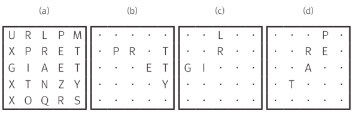

# 穷举搜索之Boggle
> gitbook这里有个坑，你在声明变量的时候，int m(0), 这样写这个代码块是没有高亮的！

**Source:** [https://algospot.com/judge/problem/read/BOGGLE](https://algospot.com/judge/problem/read/BOGGLE)



Vogel (Boggle) game figure (a) 5x5 grid the size of the alphabet, such as
starting a letter from the board by moving the pen a letter to meet him in order to find an English word games are created by listing. The pen can move vertically and horizontally, or diagonally adjacent spaces and letters can not be skipped. The passing letters back to the past is possible, but such letters without moving the pen can not write many times.

For example, in Figure (b), (C), (D) is in the lattice of the respective (a) PRETTY, GIRL, shows the results found for REPEAT.

Given Squarepants game board and a list of words that you know, from the board SquarePants Write a program that outputs whether each word you find.

Note: The algorithm problem-solving strategies are those siryeoneun solved this problem, please note read Chapter 6. Chapter 6 contains sample code is too slow to solve this problem. Please refer to chapter 6 and chapter 8.
Input

The first line of input contains the number of test cases C (C <= 50) is given. The first line of each test case SquarePants games with five letters on each plate is given five lines. All squares of the board are capital letters.
Then the number of words we know, the line N (1 <= N <= 10) is given. Then there are N lines are given one word that we know in one line. Each word consists of one letter alphabet upper case over 10 characters or less.

Print

Outputs N lines for each test case. Output in the order given for each line, type the word you know there, and if you can not find the words to output NO if not YES,.

Example input

```ini
1
URLPM
XPRET
GIAET
XTNZY
XOQRS
6
PRETTY
GIRL
REPEAT
KARA
PANDORA
GIAZAPX
```

Example Output

```ini
PRETTY YES
GIRL YES
REPEAT YES
KARA NO
PANDORA NO
GIAZAPX YES
```


## first edition:
execeed time


```c++
#include <iostream>
#include <vector>
#include <iterator>

using namespace std;

/**
* https://algospot.com/judge/problem/read/BOGGLE
 */

char board[5][5] = {0};
const int dx[8] = {-1, -1, -1, 1, 1, 1, 0, 0};
const int dy[8] = {-1, 0, 1, -1, 0, 1, -1, 1};

bool inRange(int y, int x) {
    bool flag = false;
    if (x >= 0 and x < 5 and y >= 0 and y < 5) {
        flag = true;
    }
    return flag;
}

bool has_word(int y, int x, const string &word) {
    if (!inRange(y, x)) {
        return false;
    }

    if (board[x][y] != word[0]) {
        return false;
    }

    if (word.size() == 1) {
        return true;
    }

    for (int direction = 0; direction < 8; direction++) {
        int nextX = x + dx[direction];
        int nextY = y + dy[direction];
        if (has_word(nextY, nextX, word.substr(1))) {
            return true;
        }
    }
    return false;
}


int main() {
#ifdef ONLINE_JUDGE
#else
    freopen("F:\\ClionProjects\\Algorithm\\input.txt", "r", stdin);
    freopen("F:\\ClionProjects\\Algorithm\\output.txt", "w", stdout);
#endif
    int n = 0, m = 0;
    cin >> n;
    while (n--) {
        for (int i = 0; i < 5; i++) {
            for (int j = 0; j < 5; j++) {
                cin >> board[4 - i][j];
            }
        }
//        for(auto &&row: board){
//            for(auto &&column: row){
//                cout<<column;
//            }
//            cout<<endl;
//        }
        cin >> m;
        for (int i = 0; i < m; i++) {
            string word;
            cin >> word;
            string flag = "NO";
            for (int i = 0; i < 4; i++) {
                for (int j = 0; j < 4; j++) {
                    if (has_word(i, j, word)) {
                        flag = "YES";
                        break;
                    }
                }
                if (flag == "YES") {
                    break;
                }
            }
            cout << word << " " << flag << endl;

        }

    }
    return 0;
}
```

在到达最后一个格子之前，函数会一直调用。每个格子各有8个相邻的格子，函数会根据单词N进行N－1次检索。最终，检索的答案个数为8<sup>N</sup>,所以此穷举法的时候复杂度为O(8<sup>N</sup>).
